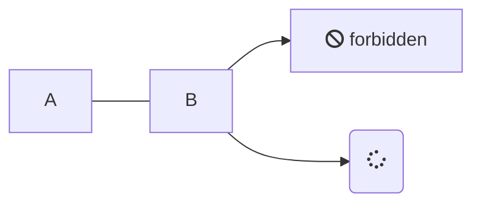
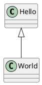

goldmark-diagram
=========================

[![GoDev][godev-image]][godev-url]

[godev-image]: https://pkg.go.dev/badge/github.com/yuin/goldmark-diagram.svg
[godev-url]: https://pkg.go.dev/github.com/yuin/goldmark-diagram

goldmark-diagram is an extension for the [goldmark](http://github.com/yuin/goldmark) that renders
fenced code blocks written in diagram description languages as diagrams instead of plain code blocks.

## Compatibility

`github.com/yuin/goldmark-diagram` is compatible with `goldmark/v2`.

## Syntax

Currently, goldmark-diagram supports diagrams in the following formats:

- [MermaidJS](https://mermaid.js.org/)
  - client-side rendering
- [PlantUML](https://plantuml.com/)
  - server-side rendering (requires a `plantuml` command in `PATH`, or configured via `WithPlantUMLCommand`)

You can use the following syntax to embed diagrams:

`````markdown



`````

## Installation

```sh
go get github.com/yuin/goldmark-diagram
```

## Usage

```go
import (
    "bytes"

    diagram "github.com/yuin/goldmark-diagram"
    "github.com/yuin/goldmark/v2/parser"
    "github.com/yuin/goldmark/v2/renderer/html"
)

func main() {
    p := parser.New()
    r := html.New(html.WithExtensions(diagram.HTMLRenderer))
    // r := html.New(html.WithExtensions(diagram.NewHTMLRenderer(
    //     diagram.WithMermaidModuleURL... via a custom mermaid renderer, see below
    // )))

    source := []byte("```mermaid\ngraph LR\n    A --- B\n```\n")
    node := p.Parse(source)

    var buf bytes.Buffer
    _ = r.Render(&buf, source, node)
}
```

MermaidJS is rendered client-side: goldmark-diagram writes the diagram source into a
`<pre class="mermaid">` element, and emits a single `<script type="module">` tag (once per
document, at the end) that imports MermaidJS from a CDN and lets it render every `.mermaid`
element on the page.

PlantUML is rendered server-side: goldmark-diagram invokes the `plantuml` command, feeding it
the diagram source on stdin and reading back an SVG on stdout, which is embedded directly into
the HTML output. If the command is missing or fails, an error message is rendered inside a
`<pre class="plantuml-error">` element instead of failing the whole render.

## Options

**HTML Renderer options**

| Option | Description | Default |
| --------|-------------| ---------|
| `diagram.WithRenderer(language diagram.Language, r diagram.Renderer)` | Registers (or replaces) the [`diagram.Renderer`](#extending) used for the given language | `{diagram.LanguageMermaid: NewMermaidClientRenderer(), diagram.LanguagePlantUML: NewPlantUMLRenderer()}` |
| `diagram.WithExcludeFunc(f diagram.ExcludeFunc)` | Sets a function to exclude certain code blocks from being rendered as diagrams | `nil` |
| `diagram.WithExcludeLanguages(langs ...diagram.Language)` | Sets a list of languages to exclude from being rendered as diagrams | `nil` |

`diagram.Language` is a defined string type identifying a diagram description language (the info
string of a fenced code block). The languages supported out of the box are exported as constants:
`diagram.LanguageMermaid` (`"mermaid"`) and `diagram.LanguagePlantUML` (`"plantuml"`). You can pass
any other string value to support additional languages via `WithRenderer` (see [Extending](#extending)).

**Mermaid renderer options** (passed to `diagram.NewMermaidClientRenderer`)

| Option | Description | Default |
| --------|-------------| ---------|
| `diagram.WithMermaidModuleURL(url string)` | Sets the URL of the MermaidJS ESM module | jsDelivr CDN, latest version |

**PlantUML renderer options** (passed to `diagram.NewPlantUMLRenderer`)

| Option | Description | Default |
| --------|-------------| ---------|
| `diagram.WithPlantUMLCommand(path string)` | Sets the path to the `plantuml` command | `"plantuml"` (resolved via `PATH`) |
| `diagram.WithPlantUMLArgs(args ...string)` | Sets the arguments passed to the `plantuml` command | `["-tsvg", "-p", "-Djava.awt.headless=true"]` |

## Extending

goldmark-diagram renders a fenced code block as a diagram by looking up a [`diagram.Renderer`]
registered for its language. `diagram.NewMermaidClientRenderer()` and `diagram.NewPlantUMLRenderer()`
are the built-in implementations for `mermaid` and `plantuml`, but you can register your own
`diagram.Renderer` for any language with `diagram.WithRenderer`, or replace a built-in one — for
example to switch MermaidJS rendering from client-side to a future server-side implementation:

```go
r := html.New(html.WithExtensions(diagram.NewHTMLRenderer(
    diagram.WithRenderer(diagram.LanguageMermaid, myServerSideMermaidRenderer),
    diagram.WithRenderer("d2", myD2Renderer), // "d2" is not a diagram.Language constant, but any string value works
)))
```

## Use goldmark-diagram with other code block extensions

This extension is implemented using `html.NodeRendererDecorator`.
You can let goldmark-diagram skip certain languages and leave them to another extension (or vice-versa) by
using the `WithExcludeLanguages` or `WithExcludeFunc` options:

```go
r := html.New(html.WithExtensions(
    diagram.NewHTMLRenderer(), // renders "mermaid" and "plantuml"
    highlighting.NewHTMLRenderer(
        highlighting.WithExcludeLanguages("mermaid", "plantuml"), // let diagram render them instead
    ),
))
```

## License
MIT

## Author
Yusuke Inuzuka
